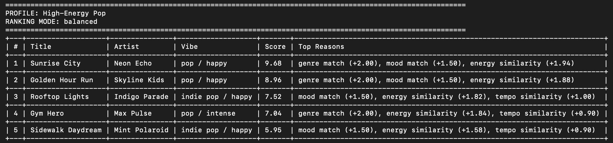
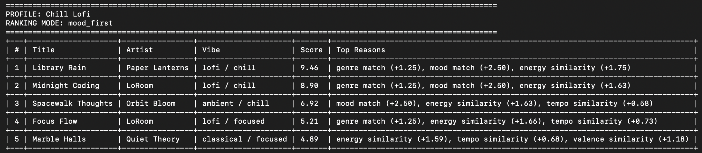
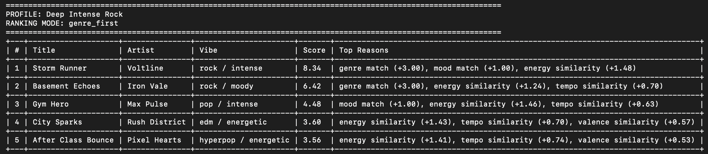
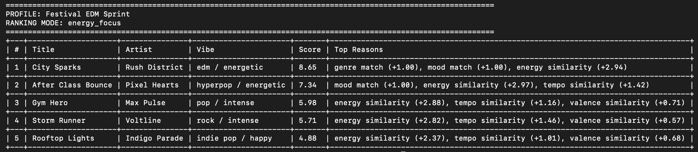

# 🎵 Music Recommender Simulation

## Project Summary

This project builds a small content-based music recommender in Python. Real recommendation systems on platforms like Spotify, YouTube, and TikTok often combine two kinds of information: content features about the item itself and behavior data from users, such as likes, skips, repeats, playlists, and watch time. In a large system, collaborative filtering uses patterns across many users, while content-based filtering uses attributes of the songs or videos themselves. My project focuses on the content-based side so the scoring logic is easy to inspect and explain.

In this version, the **input data** is the song catalog with features like genre, mood, energy, tempo, valence, acousticness, and several extra attributes. The **user preferences** are a taste profile such as favorite genre, favorite mood, target energy, and acoustic preference. The **ranking step** happens after each song gets a numeric score. The recommender then sorts the songs, applies a small diversity penalty so the top results are not too repetitive, and returns the top recommendations with plain-language reasons.

---

## How The System Works

Each song in the dataset includes features that try to describe its overall vibe. The core features are genre, mood, energy, tempo, valence, danceability, and acousticness. I also added extra attributes: popularity, release decade, detailed mood tags, instrumentalness, and live feel. These extra features make the dataset richer and allow the scoring logic to compare songs in more than one way.

The user profile stores what the listener seems to want right now. That includes favorite genre, favorite mood, target energy, target tempo, target valence, whether the listener likes acoustic songs, whether they want more instrumental tracks, and a preferred decade. The system does not try to learn from past user behavior. Instead, it compares each song directly to the profile.

The scoring system gives weighted points for matching genre and mood, then adds similarity points when a song’s energy, tempo, valence, and era are close to the target. It can also reward overlap in detailed mood tags, such as `uplifting`, `study`, or `driving`. After all songs get a score, the program ranks them and then applies a small artist and genre diversity penalty so the final list does not collapse into the same artist or same genre repeatedly.

I also implemented multiple ranking modes:
- `balanced`
- `genre_first`
- `mood_first`
- `energy_focus`

That means the same profile can be re-ranked under different priorities without rewriting the whole algorithm.

---

## Getting Started

### Setup

1. Create a virtual environment:

   ```bash
   python -m venv .venv
   source .venv/bin/activate      # Mac or Linux
   .venv\Scripts\activate         # Windows
   ```

2. Install dependencies:

   ```bash
   pip install -r requirements.txt
   ```

3. Run the app:

   ```bash
   python -m src.main
   ```

### Running Tests

 ```bash
 pytest
 ```

---

## Dataset Summary

The catalog contains **20 songs**, which satisfies the project requirement for at least 15–20 songs. It includes pop, lofi, rock, ambient, jazz, synthwave, indie pop, hyperpop, acoustic, classical, and edm. The moods include happy, chill, intense, relaxed, moody, calm, focused, romantic, and energetic.

This dataset is still small, but it is large enough to show how recommendations shift across very different user profiles.

---

## Ranking Recipe

My base scoring rule works like this:
- Genre match adds a direct bonus.
- Mood match adds a direct bonus.
- Energy similarity rewards songs that are close to the target energy, not just songs with “more” energy.
- Tempo similarity rewards songs close to the target BPM.
- Valence similarity helps distinguish brighter songs from darker songs.
- Acoustic and instrumental preferences can add a smaller bonus.
- Detailed mood tags and preferred decade add extra context.
- A diversity penalty lowers songs that repeat the same artist or genre too much in the top list.

This keeps the model interpretable. Every recommendation can show the exact reasons that led to the score.

---

## Experiments You Tried

I tested four profiles:
1. **High-Energy Pop**
2. **Chill Lofi**
3. **Deep Intense Rock**
4. **Festival EDM Sprint**

### What changed between profiles

For the **High-Energy Pop** profile, the recommender strongly favored `Sunrise City`, `Golden Hour Run`, and `Rooftop Lights`. That makes sense because those songs have bright valence, high energy, and a happy pop-adjacent feel.

For the **Chill Lofi** profile, the system shifted toward `Library Rain`, `Midnight Coding`, and `Spacewalk Thoughts`. This happened because the target energy dropped a lot, the profile liked acoustic and instrumental textures more, and the mood target emphasized calm or study-like songs.

For the **Deep Intense Rock** profile, `Storm Runner` and `Basement Echoes` rose to the top. That change makes sense because the profile prioritized rock, high energy, and a more aggressive detailed mood.

For the **Festival EDM Sprint** profile, `City Sparks` ranked first and `After Class Bounce` moved high in the list. In this case, the `energy_focus` mode made energy and tempo matter more than genre alone.

### Comments on differences between outputs

- The pop profile liked bright and happy songs with strong valence.
- The lofi profile shifted toward low-energy, more acoustic, and more instrumental tracks.
- The rock profile preferred intense songs and accepted darker valence.
- The EDM profile cared more about speed and energy than about acoustic qualities.

This showed that changing just a few feature weights can create recommendation lists that feel very different.

---

## Visual Output

The CLI uses a formatted ASCII table with these columns:
- rank
- title
- artist
- vibe
- score
- reasons

This makes the recommendations easier to read than plain print statements and helps explain why each song was selected.

---

## Terminal Screenshots






---

## Limitations and Risks

This recommender only works on a tiny catalog, so the output can still feel repetitive. It also depends on metadata rather than audio analysis or real listening history. That means it cannot understand lyrics, culture, social context, or why a listener might want something surprising instead of something similar.

Another limitation is that the weights are hand-designed by me. That makes the system transparent, but it also means the model reflects my choices about what should matter most. If genre is weighted too strongly, the system can create a small filter bubble where obvious matches crowd out creative ones.

---

## Reflection

Building this project helped me see how recommendation systems turn descriptive data into ranked predictions. The model does not “understand” music the way a person does. It just compares features and rewards closeness. Even so, the results can still feel convincing because the weighting system lines up with real human ideas like vibe, tempo, and mood.

The most interesting part was seeing how a simple formula can create both useful recommendations and bias at the same time. A stronger genre bonus can make the system look smart for one user and repetitive for another. Adding diversity penalties and multiple ranking modes helped make the recommendations more flexible and fairer.

---

## Model Card

See the full write-up here:

[**Model Card**](model_card.md)